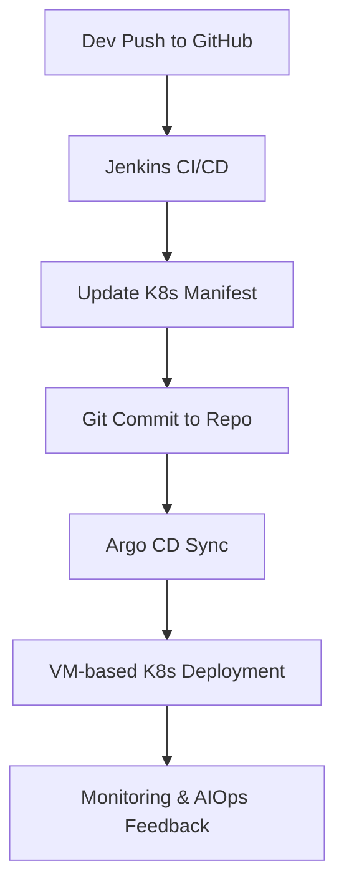
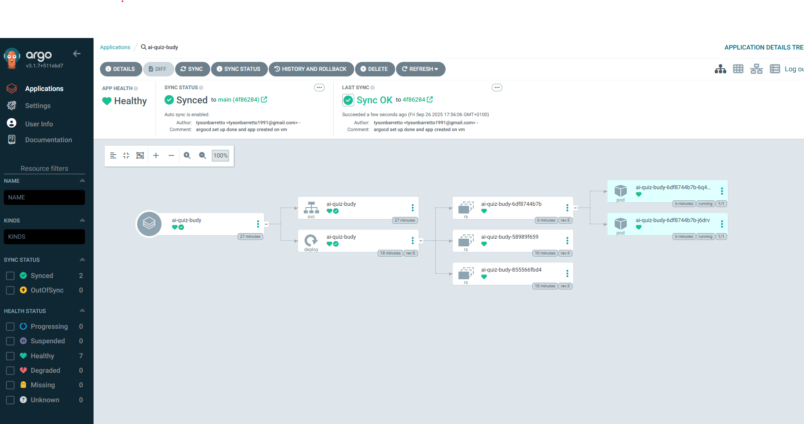
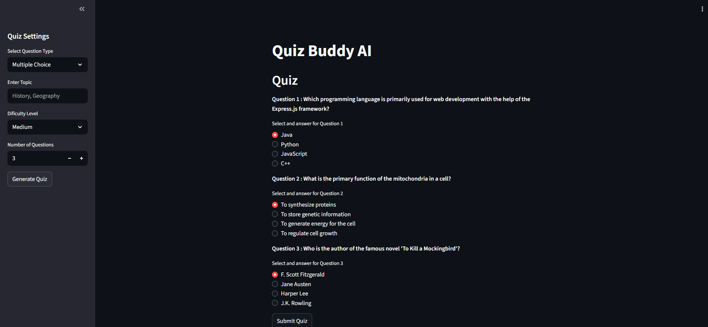

**🧠 Quiz Buddy AIOps Project Overview**

Quiz Buddy is an intelligent quiz generation platform enhanced with AIOps capabilities for automated monitoring, deployment, and scaling. The system is built on a microservice architecture and deployed on a **Google Cloud VM instance**, leveraging:

---

### ⚙️ Key Components

- **CI/CD with Jenkins**:  
  Jenkins automates build, test, and deployment pipelines. On every code push, it triggers Docker image builds and updates Kubernetes manifests.

- **GitOps with Argo CD**:  
  Argo CD continuously syncs the Git repository with the Kubernetes cluster. Any manifest changes pushed by Jenkins are automatically deployed, ensuring declarative and version-controlled infrastructure.

- **AIOps Layer**:  
  Integrated monitoring tools (e.g., Prometheus + Grafana) feed logs and metrics into ML models that detect anomalies, predict failures, and recommend scaling actions.

---

### 🧬 Deployment Flow

